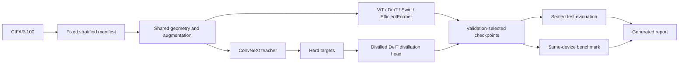

# Chapter project guide

## The project in one paragraph

You will use transfer learning to adapt ViT-S, DeiT-S, Swin-T, and EfficientFormer-L1 to CIFAR-100
under a shared training protocol. A ConvNeXt-T model is first fine-tuned as a teacher/reference; the
Distilled DeiT student is then trained both normally and with hard teacher targets so the
distillation gain can be measured with matched seeds. After selecting each checkpoint on validation
accuracy, you will evaluate the sealed test set and run synchronized inference timing on one device.
The final deliverable is a generated Markdown report, CSV tables, learning curves, and an
accuracy-throughput plot, all traceable to exact configurations and checkpoints.

## What you will learn

By completing the project, you should be able to:

- explain why global attention and weak data priors affect ViT's cost and data needs;
- distinguish DeiT's training story from a fundamentally new backbone;
- trace how windows, shifted windows, patch merging, and hierarchy change Swin's computation;
- explain why operation count and real latency can rank models differently;
- implement hard token distillation without allowing gradients into the teacher;
- design a fair transfer-learning comparison and identify its remaining confounds;
- measure accuracy, parameters, MACs, memory, latency, throughput, and training behavior; and
- make a model recommendation conditioned on a deployment constraint.

## The workflow

## A progressive reader path

### Milestone 1: verify the environment

Run `vision-bench doctor`, inspect the resolved quick preset, and perform synthetic forwards through
ViT and Distilled DeiT. At this point you should be able to identify the exact checkpoint names and
confirm that every classifier emits 100 logits.

### Milestone 2: freeze the data split

Run `prepare-data --preset quick`, then locate the manifest in `data/splits/`. Check that the quick
split has 5,000 training, 1,000 validation, and 2,000 test examples, balanced across 100 classes.
The checksum makes this data decision auditable.

### Milestone 3: follow one run

Train `vit/standard/seed 42` with the quick preset. Open `metrics.jsonl` after each epoch and identify
training loss, validation top-1, learning rates, elapsed time, and peak device memory. Interrupt and
rerun the command once to observe checkpoint resumption.

### Milestone 4: understand distillation

Train the quick ConvNeXt teacher, then compare the standard and hard-KD Distilled DeiT runs. In the
hard-KD metric rows, follow classification loss and distillation loss separately. Verify in the code
that the teacher is frozen and evaluated inside `no_grad`.

### Milestone 5: compare systems behavior

Complete the quick suite, run the benchmark, and generate the report. Explain why batch-1 latency
and batch-64 throughput answer different deployment questions. Treat the resulting ranking only as
a pipeline rehearsal.

### Milestone 6: run and defend the full experiment

Use one CUDA machine or the documented Modal workflow. The final write-up should report the exact
device, precision, batch size, number of seeds, and preset fingerprint. Make conditional conclusions
such as “best measured throughput on this L4 protocol,” not universal claims such as “fastest model.”

## Expected deliverables

For a completed chapter exercise, submit:

1. the generated `report.md` and its figures;
2. `aggregate_results.csv` and `inference_benchmark.csv`;
3. the full preset fingerprint and split checksum;
4. a short recommendation for an accuracy-first, throughput-first, and memory-constrained setting;
5. a limitations paragraph covering pretraining differences, CIFAR upsampling, hardware scope, and
   the single-seed practical baselines; and
6. one proposed follow-up experiment, with the additional compute it would require.

## Optional extensions

- Replace EfficientFormer with MobileViT or TinyViT while keeping the protocol fixed.
- Add a from-scratch ablation to expose the value of pretraining, but label it as a separate question.
- Repeat inference timing on a CPU or mobile runtime; never merge timings from different devices.
- Add calibration, class-wise recall, or energy measurement if the chapter later covers reliability
  or sustainability.
