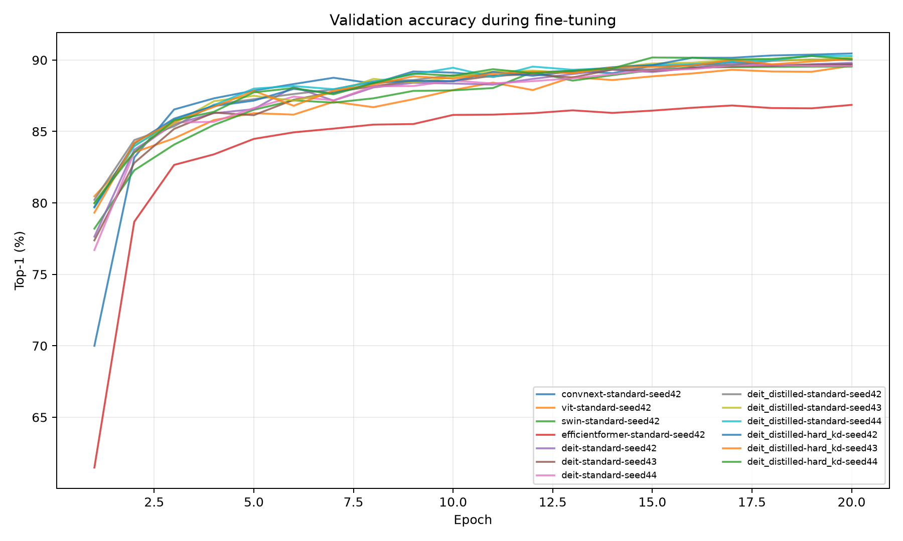
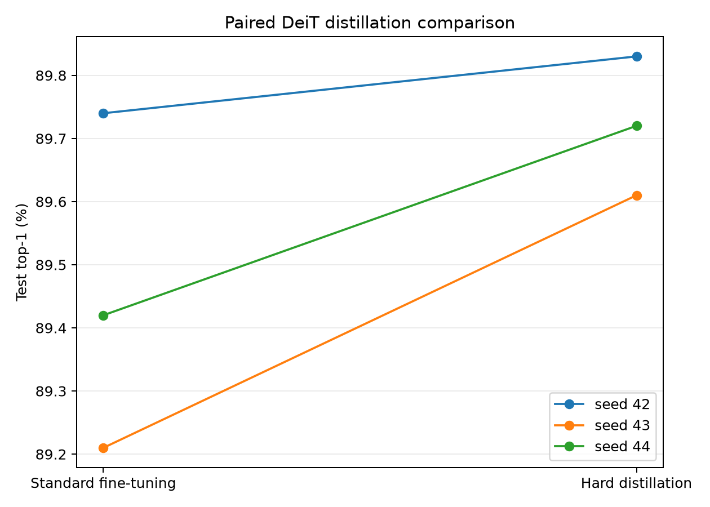
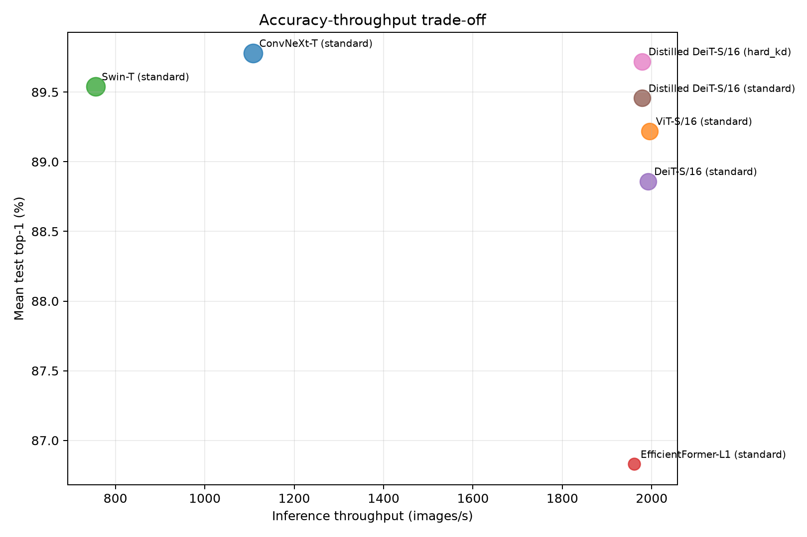

# Full vision-transformer benchmark

Configuration fingerprint: `7b87d57ae5546600c460245a81431288db34c3e40a44c2e83da01acc4160d731`.

## Main comparison

| Model | Training | Seeds | Test top-1 (%) | Parameters (M) | Images/s | Timing setting |
| --- | --- | --- | --- | --- | --- | --- |
| ConvNeXt-T | standard | 1 | 89.78 | 27.90 | 1107.96 | fp16, batch 64 |
| ViT-S/16 | standard | 1 | 89.22 | 21.70 | 1995.49 | fp16, batch 64 |
| Swin-T | standard | 1 | 89.54 | 27.60 | 755.52 | fp16, batch 64 |
| EfficientFormer-L1 | standard | 1 | 86.83 | 11.48 | 1961.13 | fp16, batch 64 |
| DeiT-S/16 | standard | 3 | 88.86 ± 0.03 | 21.70 | 1991.55 | fp16, batch 64 |
| Distilled DeiT-S/16 | standard | 3 | 89.46 ± 0.27 | 21.74 | 1978.86 | fp16, batch 64 |
| Distilled DeiT-S/16 | hard_kd | 3 | 89.72 ± 0.11 | 21.74 | 1978.86 | fp16, batch 64 |

A `±` value is the sample standard deviation across seeds; single-seed rows have no
uncertainty estimate. Throughput is an architecture property here, so the same timing is
reused for standard and hard-distilled runs of the same Distilled DeiT model.

## Isolated training-time distillation gain

This paired comparison holds the Distilled DeiT architecture and seed fixed. It isolates
the effect of using the ConvNeXt teacher during fine-tuning; comparing ordinary DeiT with
Distilled DeiT would also change the checkpoint and architecture.

| Seed | Standard top-1 | Hard-KD top-1 | Gain (points) |
| --- | --- | --- | --- |
| 42 | 89.74 | 89.83 | 0.09 |
| 43 | 89.21 | 89.61 | 0.40 |
| 44 | 89.42 | 89.72 | 0.30 |

## Hardware protocol

Device: **NVIDIA L4**; PyTorch 2.9.1+cu128; precision and batch size are shown per row. Timing excludes data loading and includes synchronized model forward passes.

The operation counter reports MAC-style fvcore operations (one multiply-add is counted as
one), plus any unsupported operators in `model_profiles.csv`. Peak memory is allocator
memory, not whole-system power or memory use.

## Training behavior and trade-offs

## Reproducibility files

- `run_results.csv`: one row per seed and training mode
- `epoch_metrics.csv`: learning curves and elapsed training time
- `aggregate_results.csv`: grouped accuracy statistics
- `distillation_gains.csv`: paired hard-distillation differences
- `model_profiles.csv` and `inference_benchmark.csv`: created after hardware benchmarking
- each run directory: resolved configuration, checkpoints, predictions, and environment data

Select checkpoints with validation accuracy only. The official CIFAR-100 test split is
evaluated after training and is not used for early stopping or hyperparameter selection.
